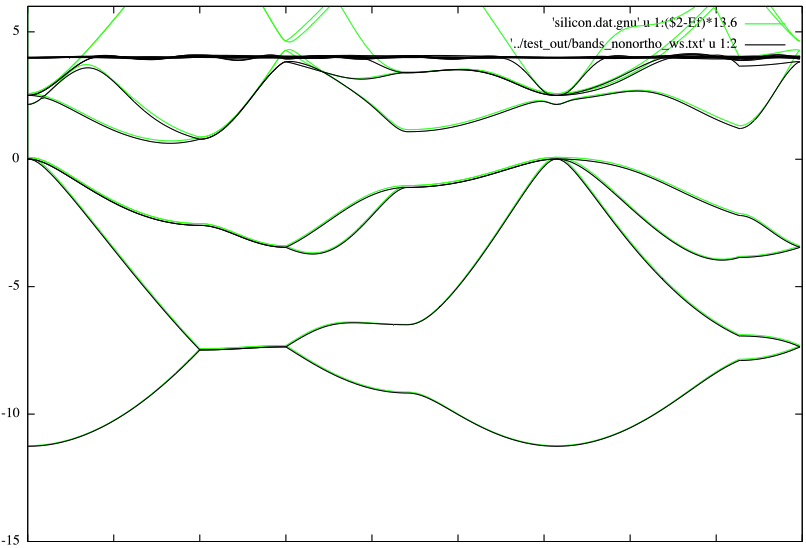

# PyTB
Ab-initio Tight Binding Hamiltonians

```bash
cd docs/test/
python test_v2.1.py
gnuplot --persist plot.gnu
```

Interpolated bandstructure for Silicon


Reference:   

[Accurate tight-binding Hamiltonian matrices from *ab initio* calculations: Minimal basis sets, PRB **93**, 035104, 2016](http://journals.aps.org/prb/abstract/10.1103/PhysRevB.93.035104)
